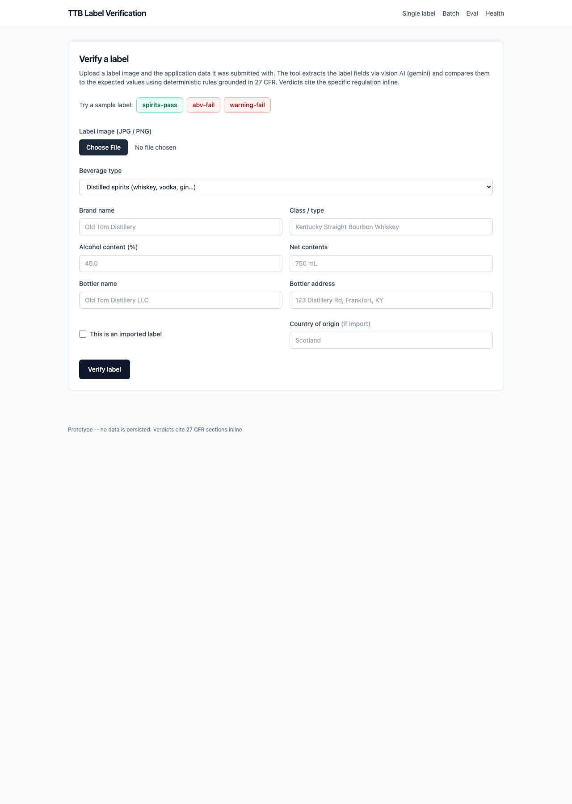
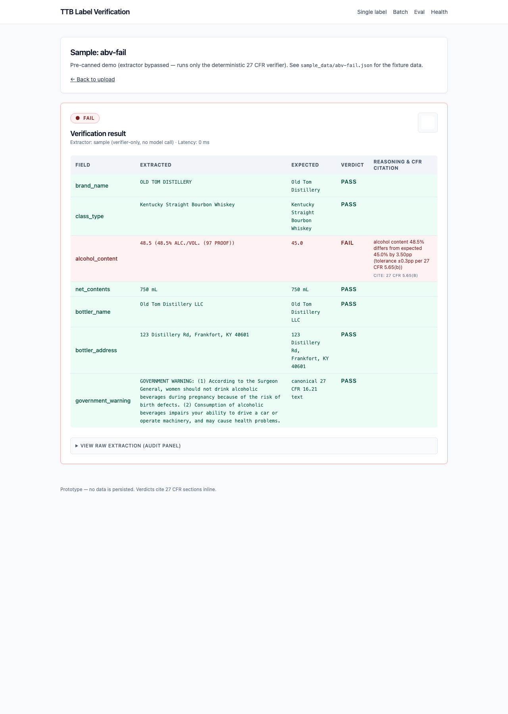

# TTB Label Verification

A prototype that helps TTB compliance agents verify alcohol-label images against the data submitted in their application. Vision AI extracts seven checklist fields with per-field confidence; a deterministic Python verifier grounded in 27 CFR compares them to the expected values and returns a per-field verdict with citable reasoning.

The split is deliberate: **AI reads the world, Python rules decide compliance**. An LLM saying "this label fails" is unreviewable. A Python rule saying *"ABV on label (45.31%) exceeds expected (45.0%) by 0.31 pp; tolerance per 27 CFR 5.65(b) is ±0.3 pp"* is reviewable, citable, and reproducible across runs. Federal context demands that.

Treasury take-home for the AI Engineer / IT Specialist role.

---

## Try it

**Live:** <https://ttb-label-verifier-pybx.onrender.com/> · Render free tier, ~10 s cold start on first request after idle.

Three preloaded samples bypass the model entirely (verifier only, no API key needed):

| Sample | Verdict | What it shows |
|---|---|---|
| [`/sample/spirits-pass`](https://ttb-label-verifier-pybx.onrender.com/sample/spirits-pass) | PASS | Clean bourbon label, all 7 fields green, raw-extraction audit panel. |
| [`/sample/abv-fail`](https://ttb-label-verifier-pybx.onrender.com/sample/abv-fail) | FAIL | 48.5% vs 45.0% ABV; cites 27 CFR 5.65(b), surfaces the 3.50 pp delta. |
| [`/sample/warning-fail`](https://ttb-label-verifier-pybx.onrender.com/sample/warning-fail) | FAIL | Title-case "Government Warning"; cites 27 CFR 16.22 (formatting layer). |





Other live routes from the home nav: `/batch` (drag-and-drop multiple labels, SSE-streamed results, CSV export) and `/eval` (in-app dashboard of the latest harness run).

---

## Run locally

Prerequisites: macOS / Linux, Python ≥ 3.11, `git`, `make`. No frontend build step — HTMX + Alpine + Tailwind via CDN.

```bash
git clone https://github.com/seeincodes/ttb-label-verifier.git
cd ttb-label-verifier
cp .env.example .env                # then set GEMINI_API_KEY (required)
make install                        # creates .venv/, installs requirements.txt
make dev                            # http://localhost:8000
```

The deployed URL works without keys for the `/sample/*` routes; the upload form needs a Gemini key to extract from a real image.

Other targets: `make test` (340+ tests, <5 s), `make eval` (writes a timestamped JSON the in-app `/eval` dashboard reads), `make smoke-extractor` (real Gemini call end-to-end). Env vars are defined in `.env.example` and loaded by `app/config.py`.

---

## Architecture

```
Browser (HTMX + Alpine + Tailwind, no build step)
        │
        ▼  multipart POST /verify or /extract
┌───────────────────────────────────┐
│ FastAPI route                     │
│   image-quality pre-check         │  (classical CV; rejects too-dark / too-bright / blank)
│        │                          │
│        ▼                          │
│   cache.get(sha256(bytes))        │  (LRU; hit returns sub-ms)
│        │  miss                    │
│        ▼                          │
│   LabelExtractor ABC              │  one ~30-line abstraction; concrete:
│     · GeminiExtractor (primary)   │    Gemini 2.5 Flash (7–9 s on Render in practice)
│     · OpenAIExtractor (fallback)  │    GPT-4o on Gemini failure
│        │                          │
│        ▼  LabelData JSON          │
│   verify_label()                  │  per-field rules; each cites a 27 CFR section
│        │                          │
│        ▼  VerificationResult      │
└────────│──────────────────────────┘
         ▼
    Jinja2 fragment → HTMX swap
```

The cache stores the *extraction*, not the verification, so re-verifying with different expected data is sub-millisecond without re-paying for the model call. Batch flow adds `GET /batch/stream/{run_id}` (SSE) and `GET /batch/export/{run_id}.csv` (CSV export).

Layer files: `app/extractors/{base,gemini,openai,prompt}.py`, `app/verifier/{rules,tolerances,warning,normalize}.py`, `app/cache.py`, `app/image_quality.py`, `app/models.py` (every Pydantic model), `app/main.py` (routes).

---

## Field-by-field design split

For each of the seven TTB checklist fields, the design draws an explicit line between what the model does (read the world) and what the verifier does (decide compliance):

| Field | What the LLM does | What deterministic Python does |
|---|---|---|
| **Brand name** | Read text, return `{value, confidence}`. | Normalize (apostrophe deletion, case-fold), `rapidfuzz.token_sort_ratio`, threshold 95 / 80 / <80. |
| **Class / type** | Read the class designation. | Fuzzy match. For wine, also checks **27 CFR 4.21** standard-of-identity bands — a 14.5% wine labelled "Table Wine" FAILs on class designation even when the numeric ABV is within §4.36 tolerance. Tolerance alone would silently PASS. |
| **Alcohol content** | Return both numeric percent AND raw text ("45% ALC./VOL.") as two fields. | Numeric tolerance per beverage (27 CFR 5.65 / 7.65 / 4.36); `\bABV\b` regex on raw text (the prohibited abbreviation). The dual-field shape lets us run both checks without conflating them. |
| **Net contents** | Read the volume string. | `normalize_volume` + `volumes_equivalent` — 750 mL ↔ 0.75 L silently PASSes. Unparseable volume FAILs with an actionable reason, not a silent PASS. |
| **Bottler name** | Read the name. | `strip_corporate_suffixes` (LLC, Inc., Co.) → normalize → fuzzy match. |
| **Country of origin** | Read the country if visible; null + low confidence if not. | Skip entirely when `is_import=False`; FAIL with `27 CFR 5.36(d) / 4.39 / 7.26` when import but missing. |
| **Government warning** | Return text verbatim + answer 3 yes/no formatting questions (caps, bold, continuous). | Two layers: text compared to canonical **27 CFR 16.21** (whitespace-collapsed); booleans aggregated and cited to **27 CFR 16.22**. ERROR if formatting confidence is `low` — we never assert PASS on what the model couldn't see. |

**The MVP9 confidence gate.** The prompt requires per-field `high | medium | low` with explicit instructions to return `null + low` rather than guess. Any required field at `low` → verdict ERROR rather than risking a false PASS / FAIL. Optional fields at `low` → WARN ("unverifiable"), never bubbles to overall ERROR.

**Why `\bABV\b` lives in the verifier, not the prompt.** 27 CFR 5.65 / 7.65 / 4.36 prohibit the literal abbreviation "ABV" on labels (acceptable: "Alc./Vol.", "ALC. BY VOL."). Asking the model "is this prohibited?" is a single point of failure with no audit trail. Asking the model to return text verbatim and letting a regex own the rule produces a FAIL anyone can review.

Full architectural decisions, CFR citation table, stakeholder-signals map, and the production path live in [`docs/DESIGN_NOTES.md`](docs/DESIGN_NOTES.md).

---

## Eval results

`make eval` runs the deterministic verifier against 21 hand-authored JSON fixtures across 4 buckets (5 easy / 5 hard image-quality / 5 violations / 6 edge cases including the STR6 wine-class-boundary case).

| Metric | Value | Source |
|---|---|---|
| Overall verdict agreement (actual == expected) | **21 / 21** (100%) | `tests/test_harness_metrics.py::test_runs_all_fixtures_and_actual_matches_expected` |
| False-positive rate (PASS on a true violation) | **0.0000** | `eval/harness.py` |
| False-negative rate (FAIL on a valid label) | **0.0000** | `eval/harness.py` |
| Verifier latency p95 | sub-ms (string normalization-dominated) | `make eval` output |

These numbers are deliberately unimpressive on their own — the fixtures were hand-authored against the verifier's behavior, so a non-zero rate would mean a fixture bug or a regression. The **value** of the suite is drift detection: every `make test` re-runs the agreement check, so a verifier change that flips a fixture's verdict fails CI immediately.

The STR6 fixture (14.5% wine labelled "Table Wine") is the regulatory subtlety worth flagging — a tolerance-only verifier would silently PASS; ours FAILs on class designation citing 27 CFR 4.21.

A/B comparison between Gemini and OpenAI: fixture mode bypasses the extractor (deterministic verifier path only), so the A/B is structurally identical by construction. Real-image A/B is documented in `eval/README.md` as future work — the `LabelExtractor` ABC is exactly the seam it lands at.

---

## Trade-offs

**Out of scope for the prototype** (production path documented in `docs/DESIGN_NOTES.md`):

- **PDF labels.** JPG / PNG only.
- **Persistent storage.** In-memory LRU cache only, wiped on restart. Deliberate PII-avoidance choice.
- **Authentication and CSRF.** Neither. Production deploy adds agency SSO at the FastAPI middleware layer and a CSRF token on the multipart forms. There's no authenticated state to attack today, but both belong in the same production pass.
- **Background queue for large batches.** SSE + `asyncio.Semaphore(5)` is fine for ≤50 labels per run. Larger needs a real queue.
- **GovCloud routing.** Gemini calls go to `generativelanguage.googleapis.com`; Vertex AI (FedRAMP / IL4) is the production routing.
- **Font-size measurement** on the government warning. 27 CFR 16.22 sets minimum heights (1 / 2 / 3 mm by container volume); the prototype checks only caps / bold / continuous.
- **Free-tier API caps.** Gemini free tier is 5 requests/minute, 20/day per model. A 429 on the deployed URL is the quota wall, not an app bug. The fallback layer retries with OpenAI on a Gemini error; the OpenAI account in this development environment has `insufficient_quota`, so end-to-end fallback testing against real APIs is currently gated by billing.

Honest gotchas surfaced during development live in [`docs/ERROR_FIX_LOG.md`](docs/ERROR_FIX_LOG.md) — including the `google-genai` 10s timeout floor, the Gemini transient 503 pattern, and the upload-prefill two-source-comparison interaction.
